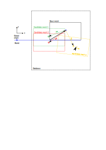
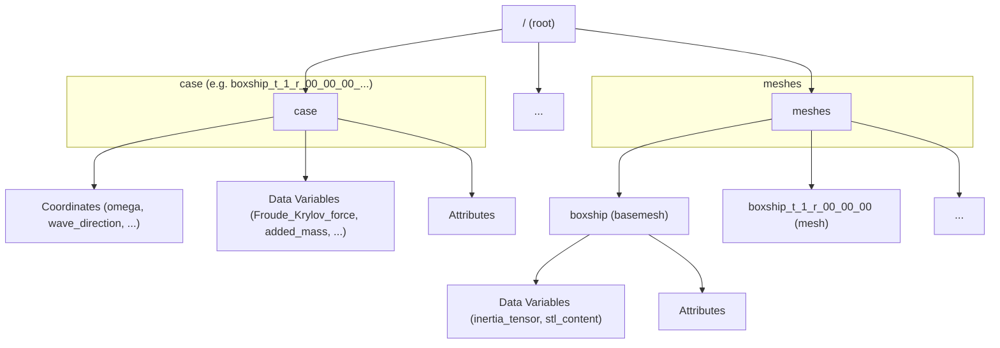

# Solution Database

## Introduction

Fleetmaster is used to generate a HDF5 database containing a collection of solutions of capytaine based on a single basemesh. The solutions can vary depeding on
parameters such a draft of the mesh, rotation of the mesh, forward speed of the vessel (input parameter for Capytaine) or the depth. Each individual mesh transform
(based on draft and rotation) is stored under the section `meshes`. All the solutions are stored per section in the HDF5 database. A single solution always contains
the name of the input mesh that was used for the solution and all the other values that were varied for that specific case.

## Mesh definitions

Each HDF5 database is built around a single **base mesh**. This base mesh serves as the fundamental reference geometry. It has a `base_origin` point, which should correspond to a known world coordinate point when you position the mesh in a global context. The name of this base mesh is stored as a root-level attribute named `base_mesh` in the HDF5 file. The geometry of the base mesh itself is stored as a dataset within the `/meshes` group.

In addition to the base mesh, the `/meshes` group can contain multiple **candidate meshes**. Each candidate mesh represents a variation of the base mesh and has the following characteristics:

- A unique mesh name.
- Its own geometry, stored as a dataset.
- A `translation` and `rotation` attribute, which define its position and orientation relative to the base mesh's `base_origin`.
- A specific `cog` (center of gravity) attribute. This `cog` is used by Capytaine as the center for the BEM (Boundary Element Method) solution.

The transformation from the base mesh to a candidate mesh is applied in a specific order: first, the rotation is performed around the `cog`, and then the translation is applied. These transformation attributes are stored for each mesh.

{id="database"}

In [figure 1](#database), the the relation between the base mesh with the different meshes is shown.
The black box represents the base mesh, assumed to be with the keel on the water surface ($z=0$) and with the stern on $x=0$ and $y=0.
The base mesh can be any stl file respresenting the floating body for which you want to calculate the force response values. 
The position of the base mesh is arbitrary, so could be positioned anyware. The relation of the base mesh to the real world is established 
via the base_origin, given by the black vector point from the left bottom corner of the base mesh to the black circle in the middle. 
Both the base name and origin are stored in the root level of the database. 
You can relate the base mesh to the real word by connecting the base origin to your real world coordinate system.

Normally, the base mesh it not used to calculate your hydrodynamic data with Capytaine. This is done at your Candidate mesh positions. 
In [figure 1](#database), these are represented by the green, red and yellow box, labeled candidate mesh 1, 2, and 3, respectively. 
The relation between the base mesh and the candidate mesh is given by a translation vector, a rotation vector and a cog-vector of the mesh. 
The cog-vector does not have to correspond to the real geometry cog of your mesh (although this is choosen by default if no vector is given by default).
Normally it can just be put to 0,0,0 (in the center on the waterline). The cog position is also use to define your rotation about.

In our example, both the red and green mesh are shifted backward such that the cog of the mesh is at (0, 0, 0). The mesh itself is shifted
downward to establish a draft of your vessel. The rotation for the green and red box is assued to be (0, 0, 0)

The yellow box gives an example of a cadnidate mesh that is shifted  downward  and given a small positive rotation about the y axis. This is stored 
in the rotation vector belong to the yellow mesh. 

All candidate meshes in the system are stored with a unique name into the hdf5 database under the 'meshes' section. 

Then, we can define Capytaine cases for each of these candidate meshes. On mesh can be connected to multiple cases, but a case can only connect to one mesh. This allow us to define multiple case to a similar graph, such that variations of the forward speed or water depth can be carried out.
For each case, the solution is stored in a seperate case entry. 

The capytain solutions per case are calculated on a mesh with multiple directions (headings of the waves) and periods (wave frequencies). 
Each case can have its own definition of direction and periods.

## HDF5 file structure

The structure of the database is given in the diagram below. The root contains the root property base_mesh and base_origin.
The there are to major chapters: one `meshes` sector (with all the meshes) and one `cases` sector (with all the cases).

The HDF5 file has two main groups at the root level:

- **cases**: A variable number of groups, each representing a single Capytaine solution for a specific condition (transformation, forward speed, etc.). The group name is a composite of the parameters.
- **meshes**: This group contains all the mesh geometries.

### Root Attributes

The root of the HDF5 file has the following attributes:

- `base_mesh`: The name of the base mesh (e.g., `boxship`).
- `base_origin`: The origin of the base mesh.

### Case Group

Each case group (e.g., `/boxship_t_1_r_00_00_00_wd_inf_wl_0_fs_0`) contains the full output of a Capytaine simulation.

| Category           | Name                  | Description                                           |
| :----------------- | :-------------------- | :---------------------------------------------------- |
| **Coordinates**    | `omega`               | Array of wave frequencies.                            |
|                    | `wave_direction`      | Array of wave directions.                             |
|                    | `influenced_dof`      | Degrees of freedom being influenced.                  |
|                    | `radiating_dof`       | Degrees of freedom that are radiating.                |
| **Data Variables** | `Froude_Krylov_force` | Froude-Krylov force components.                       |
|                    | `added_mass`          | Added mass matrix.                                    |
|                    | `radiation_damping`   | Radiation damping matrix.                             |
|                    | `diffraction_force`   | Diffraction force components.                         |
|                    | `excitation_force`    | Total excitation force (Froude-Krylov + Diffraction). |
|                    | `body_name`           | Name of the body.                                     |
|                    | `forward_speed`       | Forward speed of the vessel.                          |
|                    | `...`                 | Other variables from Capytaine.                       |
| **Attributes**     | `mesh_name`           | Name of the mesh used for this case.                  |
|                    | `draft`               | Draft of the mesh.                                    |
|                    | `transformation`      | Transformation matrix applied to the mesh.            |
|                    | `rotation`            | Rotation applied to the mesh.                         |
|                    | `...`                 | Other case-specific attributes.                       |

### Meshes Group

The `/meshes` group contains a subgroup for each mesh.

| Category           | Name                            | Description                                              |
| :----------------- | :------------------------------ | :------------------------------------------------------- |
| **Data Variables** | `inertia_tensor`                | The 3x3 inertia tensor of the mesh.                      |
|                    | `stl_content`                   | The binary content of the STL file for the mesh.         |
| **Attributes**     | `name`                          | Name of the mesh.                                        |
|                    | `bbox_lx`, `bbox_ly`, `bbox_lz` | Dimensions of the bounding box.                          |
|                    | `cog`                           | Center of gravity used by Capytaine `[x, y, z]`.         |
|                    | `cog_x`, `cog_y`, `cog_z`       | Individual components of the center of gravity.          |
|                    | `rotation`                      | Rotation applied to the mesh `[rx, ry, rz]`.             |
|                    | `translation`                   | Translation applied to the mesh `[tx, ty, tz]`.          |
|                    | `volume`                        | Displaced volume of the mesh.                            |
|                    | `sha256`                        | SHA256 hash of the mesh geometry for integrity checking. |
