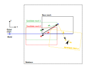

# Solution Database

## Introduction

Fleetmaster is used to generate a HDF5 database containing a collection of solutions of capytaine based on a single basemesh. The solutions can vary depeding on
parameters such a draft of the mesh, rotation of the mesh, forward speed of the vessel (input parameter for Capytaine) or the depth. Each individual mesh transform
(based on draft and rotation) is stored under the section `meshes`. All the solutions are stored per section in the HDF5 database. A single solution always contains
the name of the input mesh that was used for the solution and all the other values that were varied for that specific case.

## Mesh definitions

The database that is generated by fleetmaster contains one or more capytaine solutions, together with the mesh that was used for the solution calculation.
The general idea is that you make one version of your mesh which is stored as the Base mesh. Normally this would be the vessel hull, but in our example we have just a small box called Base Mesh.
Typically you base mesh is located with the keel at the water level (which is $z=0$ by default) and the stern at $x=0$.

In [figure 1](#database), the the relation between the base mesh with the different meshes is shown.
A Base Mesh is defined by the stl file name. The base mesh is stored under meshes. The name of the base mesh is stored in the attribute 'base_memsh'

{id="database"}

## Description of the database

The `Base mesh` is used as a reference. There are several `Candidate meshes` relative to the base mesh, each with its own defined center of gravity (cog). This cog can be independent of the actual geometric center of gravity; it is the cog used by Capytaine. By default, it is the center of the geometry at the water surface, so (0,0,0).

## HDF5 file structure

The HDF5 file has two main groups at the root level:

- **cases**: A variable number of groups, each representing a single Capytaine solution for a specific condition (transformation, forward speed, etc.). The group name is a composite of the parameters.
- **meshes**: This group contains all the mesh geometries.

### Root Attributes

The root of the HDF5 file has the following attributes:

- `base_mesh`: The name of the base mesh (e.g., `boxship`).
- `base_origin`: The origin of the base mesh.

### Case Group

Each case group (e.g., `/boxship_t_1_r_00_00_00_wd_inf_wl_0_fs_0`) contains the full output of a Capytaine simulation.

| Category           | Name                  | Description                                           |
| :----------------- | :-------------------- | :---------------------------------------------------- |
| **Coordinates**    | `omega`               | Array of wave frequencies.                            |
|                    | `wave_direction`      | Array of wave directions.                             |
|                    | `influenced_dof`      | Degrees of freedom being influenced.                  |
|                    | `radiating_dof`       | Degrees of freedom that are radiating.                |
| **Data Variables** | `Froude_Krylov_force` | Froude-Krylov force components.                       |
|                    | `added_mass`          | Added mass matrix.                                    |
|                    | `radiation_damping`   | Radiation damping matrix.                             |
|                    | `diffraction_force`   | Diffraction force components.                         |
|                    | `excitation_force`    | Total excitation force (Froude-Krylov + Diffraction). |
|                    | `body_name`           | Name of the body.                                     |
|                    | `forward_speed`       | Forward speed of the vessel.                          |
|                    | `...`                 | Other variables from Capytaine.                       |
| **Attributes**     | `mesh_name`           | Name of the mesh used for this case.                  |
|                    | `draft`               | Draft of the mesh.                                    |
|                    | `transformation`      | Transformation matrix applied to the mesh.            |
|                    | `rotation`            | Rotation applied to the mesh.                         |
|                    | `...`                 | Other case-specific attributes.                       |

### Meshes Group

The `/meshes` group contains a subgroup for each mesh.

| Category           | Name             | Description                                      |
| :----------------- | :--------------- | :----------------------------------------------- |
| **Data Variables** | `inertia_tensor` | The 3x3 inertia tensor of the mesh.              |
|                    | `stl_content`    | The binary content of the STL file for the mesh. |
| **Attributes**     | `name`           | Name of the mesh.                                |
|                    | `cog`            | Center of gravity.                               |
|                    | `volume`         | Displaced volume of the mesh.                    |
|                    | `...`            | Other mesh properties.                           |
