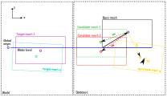

# Mesh Fitting

Fleetmaster provides a powerful mesh fitting capability that allows you to find the best matching mesh from a database of pre-calculated meshes based on a target transformation (translation and rotation). This is particularly useful in scenarios where you have a database of hydrodynamic results for a vessel at various drafts and trim/heel angles, and you want to find the results that best correspond to a new loading condition.

{: style="background-color:white;" }

## How it Works

The core of the fitting functionality is the `find_best_matching_mesh` function. This function takes a target transformation and an HDF5 database file as input and returns the name of the best matching mesh from the database.

The process involves the following steps:

1.  **Load Data**: The function loads a `base_mesh` and a set of `candidate_meshes` from the specified HDF5 file. The `base_mesh` is the original, untransformed mesh of the vessel, while the `candidate_meshes` represent the vessel at different, pre-defined transformations (e.g., different drafts, roll, and pitch angles).

2.  **Hybrid Transformation**: For each `candidate_mesh`, a hybrid transformation is applied to the `base_mesh`. This transformation is designed to isolate the parameters that are most relevant for hydrodynamic behavior:

    - **Z-translation (draft)** and **X/Y-rotations (roll, pitch)** are taken from the _target_ transformation.
    - **X/Y-translation** and **Z-rotation (yaw)** are taken from the _candidate's_ transformation.

    This approach allows for a fair comparison of the submerged shape of the vessel, which is primarily what influences the hydrodynamic response.

3.  **Chamfer Distance**: The wetted surface of the transformed `base_mesh` is then compared to the wetted surface of the `candidate_mesh` using the **Chamfer distance**. This metric calculates the average distance between the vertices of the two meshes, providing a robust measure of their similarity. A lower Chamfer distance indicates a better fit.

4.  **Best Match**: The function returns the name of the `candidate_mesh` with the lowest Chamfer distance, which is considered the "best fit".

## Usage Example

Here is an example of how to use the `find_best_matching_mesh` function:

```python
from pathlib import Path
from fleetmaster.core.fitting import find_best_matching_mesh

# Path to the HDF5 database
hdf5_path = Path("path/to/your/database.hdf5")

# Target transformation
target_translation = [0.0, 0.0, -1.5]  # Target draft of 1.5m
target_rotation = [5.0, 0.0, 0.0]      # Target roll of 5 degrees

# Find the best matching mesh
best_match, distance = find_best_matching_mesh(
    hdf5_path=hdf5_path,
    target_translation=target_translation,
    target_rotation=target_rotation,
    water_level=0.0,
)

if best_match:
    print(f"Best match found: {best_match}")
    print(f"Chamfer distance: {distance:.4f}")
```

This functionality enables you to efficiently leverage pre-computed hydrodynamic databases, finding the most relevant data for any given loading condition without needing to run new simulations for every case.
